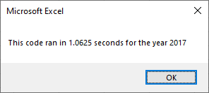
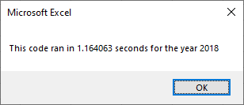
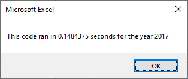
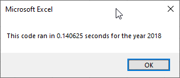

# VBA Challenge

## Overview
The purpose of this project is to take VBA code made to analyze a set of data based on stocks and refactor it to become more efficient in runtime. The code is used to analyze the total daily volume and the return per year of various stocks being tracked. The code does this by matching stocks based on their tickers, small 2-4 letter series used to differentiate different stocks. The original issue at hand is that the code took much longer to run due to various issues involving the usage of for loops inefficiently running through the dataset multiple times. I came in with the purpose of streamlining the code so that the dataset would only have to be scanned once to make the same conclusions using a number of arrays to store different data.
 
 ## Results
 For the sake of a baseline we must look at the original run times for both example sheets used in this project.
 
 
 This is the original code running through the 2017 stock data.
 
 
 
 This is the same code running through the 2018 stock data.
 Now that we understand the speed of the original code we can also understand how much more efficient the refactored code was.
 
 
 
 As we can see there is a large, over 80%, reduction in runtime from the original code to the refactored code for the 2017 sheet.
 
 
 
 Now we can also see that this is a repeated fact with the 2018 data sheet.

## Summary

### Why Refactor Code in General?
The primary reason one would want to refactor code is to help streamline the code they created to be more efficient. This obviously helps with code that is run often and therefore wastes exponentially more time the more it's run using an older slower version. However, one must also consider the time it takes for a person to refactor their code versus the time taken to create new code for another project that could also save time. This means that refactoring code should primarily be done for code that is both slow and run often. Saving the most runtime for those using it, and dev time from the developer making the code.

### Pros and Cons of Original Code
The original code was obviously much slower than the refactored code for one primary reason. The original code would go through the data set one for loop at a time checking each individual ticker, taking down the necessary values, and then printing the results for each ticker at the end of a for loop, before restarting the loop for another ticker. This meant that in this worksheet alone at least 12 loops were done for each ticker and result value. By using arrays in the new code we are able to skip the printing of results at the end of a for loop, gather all of the data in one for loop, and then print the results for all the tickers in the sheet at one time. The primary pro of this original code is a weakness of the refactored code, out of order tickers. If by some odd reason a dataset is not ordered the way we have ordered the tickers in the refactored code, we could get large errors in the volumes and ending prices for all of the results. This is a small issue in Excel which would order them for you, but one to consider.
